# Questflow

Questflow — fullstack-платформа для командной работы с задачами и встроенной геймификацией. Пользователь закрывает реальные дела (карточки на доске, привычки, личные задачи) и получает прогресс персонажа: XP, HP, квесты, сундуки и косметику.

**Демо:** [https://quest-flow.up.railway.app/](https://quest-flow.up.railway.app/)

[Скриншоты](#screenshots)

В приложении три слоя:

- **Рабочий слой** — воркспейсы, доски, списки, карточки, комментарии, роли и приглашения.
- **Прогрессионный слой** — персонаж, XP/HP, чекины, стрики, квесты, сундуки, пыль, achievements.
- **Solo-слой** — раздел «Привычки» (`/personal`): привычки, ежедневные и личные задачи без воркспейса.

---

## Содержание

- [Возможности](#features)
- [Технологии](#tech)
- [Быстрый старт](#quickstart)
- [API](#api)
- [Аутентификация](#auth)
- [Разделы приложения](#sections)
- [Архитектура frontend](#frontend-arch)

---

<h2 id="features">Возможности</h2>

### Совместная работа

- [x] Воркспейсы с ролями `OWNER` / `ADMIN` / `MEMBER`
- [x] Персональный порядок воркспейсов (перетаскивание на `/workspaces`, `WorkspaceMember.sortOrder`)
- [x] Приглашения по email: принять / отклонить / отозвать
- [x] Kanban: `Workspace → Board → List → Card`
- [x] Перетаскивание карточек и колонок, исполнители, дедлайны, комментарии, вложения
- [x] Журнал активности воркспейса

### Геймификация

- [x] Один персонаж на пользователя, уровни 1–100, HP
- [x] XP за закрытие карточек, личных задач, ежедневных и привычек «+»
- [x] Дневной лимит активности (`DAILY_ACTIVITY_XP_MAX` = 500 XP)
- [x] Daily check-in и streak по игровому дню (`GAME_DAY_TZ`)
- [x] Квесты: daily / weekly / monthly
- [x] Сундуки, пыль за дубликаты, магазин сундуков
- [x] Achievements за ключевые этапы прогресса
- [x] Идемпотентность XP-событий (уникальные ограничения БД + коды API)

### Solo (`/personal`)

- [x] Три колонки: привычки (+/−), ежедневные, задачи
- [x] XP/HP и прогресс квестов в общей экономике с досками
- [x] Штрафы HP за «−» привычку и пропуск ежедневных
- [x] Онбординг: после создания персонажа без воркспейса → `/personal`

### Социальное и рейды

- [x] Друзья по `friendCode`, заявки accept/decline
- [x] Личные сообщения 1:1 (REST + poll)
- [x] Рейд-боссы для пати друзей (2–8 игроков), мана за XP-карточки

### Инфраструктура

- [x] NestJS + Prisma + PostgreSQL
- [x] Redis: refresh-сессии, rate limiting
- [x] React + Vite, pixel UI
- [x] Swagger (`/api/docs`)
- [x] Pino + Grafana Loki
- [x] SendGrid для транзакционных писем
- [x] Docker Compose для полного стека
- [x] Jest unit-тесты backend (порог покрытия 80%)

---

<h2 id="tech">Технологии</h2>

| Слой | Технологии |
|------|------------|
| API | NestJS, TypeScript, class-validator, Swagger |
| Данные | PostgreSQL, Prisma (схема, миграции) |
| Кеш / лимиты | Redis (refresh-сессии, rate limiting) |
| Frontend | React, TypeScript, Vite |
| Auth | JWT, Passport (Google OAuth), bcrypt |
| Почта | SendGrid |
| Логи / наблюдаемость | Pino, Promtail, Grafana Loki, Grafana |

---

<h2 id="quickstart">Быстрый старт</h2>

### 1. Переменные окружения

```bash
cp backend/.env.example backend/.env
```

Заполните переменные: `DATABASE_URL`, `JWT_*`, `REDIS_URL`, `GOOGLE_*`, `SENDGRID_*`, `GAME_DAY_TZ` и др.

### 2. Зависимости и миграции

```bash
cd backend && npm install
cd ../frontend && npm install

cd ../backend
npx prisma migrate deploy   # или prisma migrate dev
```

### 3. Локальный запуск

```bash
# Backend
cd backend && npm run start:dev

# Frontend (отдельный терминал)
cd frontend && npm run dev
```

### 4. Docker (полный стек)

```bash
cd backend
docker compose up --build
```

### 5. Тесты backend

```bash
cd backend
npm run test:cov
npm test
```

---

<h2 id="api">API</h2>

| Ресурс | URL |
|--------|-----|
| Приложение (prod) | [https://quest-flow.up.railway.app/](https://quest-flow.up.railway.app/) |
| Base URL (local) | `http://localhost:3000/api` |
| Swagger (local) | `http://localhost:3000/api/docs` |
| Health (local) | `http://localhost:3000/api/health` |

Основные группы эндпоинтов: `auth`, `user`, `workspace`, `board`, `list`, `card`, `comment`, `character`, `personal`, `social`, `party`, `notifications`, `user-settings`.

---

<h2 id="auth">Аутентификация</h2>

- Регистрация и вход по email + пароль
- Access + refresh токены (refresh в httpOnly cookie)
- Вход через Google OAuth
- Подтверждение email и восстановление пароля
- Управление сессиями и security events в `/settings`

---

<h2 id="sections">Разделы приложения</h2>

| Раздел | Маршрут | Назначение |
|--------|---------|------------|
| Привычки (solo) | `/personal` | Привычки, ежедневные, личные задачи |
| Воркспейсы | `/workspaces` | Список WS, порядок перетаскиванием |
| Доска | `/workspaces/:ws/boards/:board` | Kanban, карточки, перетаскивание |
| Персонаж | `/profile/character` | Квесты, сундуки, косметика, рейд |
| Сообщения | `/messages` | DM, заявки в друзья |
| Настройки | `/settings` | Аккаунт, безопасность, приватность |
| Уведомления | `/notifications` | XP, квесты, сундуки, mentions |

Rail: вкладка **«Привычки»** между «Доски» и «Персонаж».

---

<h2 id="frontend-arch">Архитектура frontend</h2>

Гибридная структура (FSD-подобная):

| Слой | Путь | Назначение |
|------|------|------------|
| App | `frontend/src/app` | Вход, app-shell, глобальные стили |
| Pages | `frontend/src/pages` | Экраны и роуты |
| Widgets | `frontend/src/widgets` | Крупные UI-блоки (rail, guide, modals) |
| Features | `frontend/src/features` | Пользовательские сценарии |
| Entities | `frontend/src/entities` | Доменные сущности |
| Shared | `frontend/src/shared` | API-клиент, утилиты, UI-kit |

Константы наград синхронизируются с backend: `frontend/src/lib/xpRewards.ts` ↔ `backend/src/gamification/config/rewards.ts`.

---

<h2 id="screenshots">Скриншоты</h2>

`backend/uploads/demo/`

### Вход и онбординг

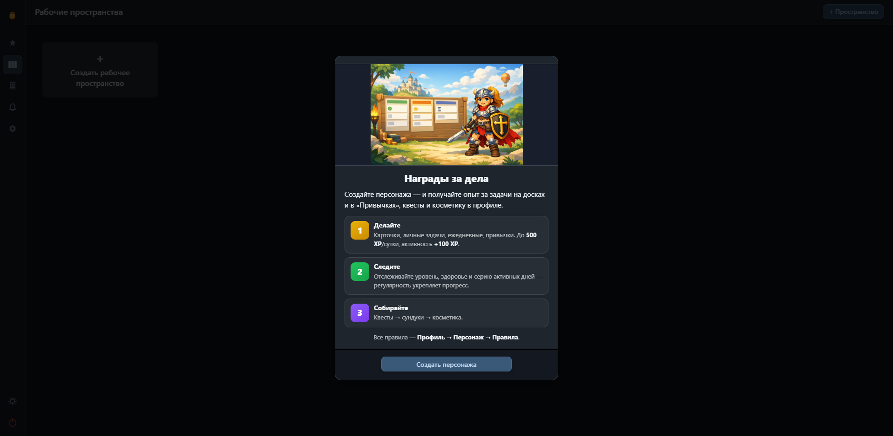
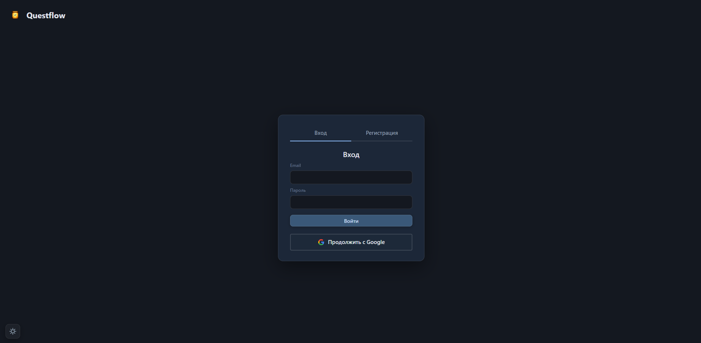
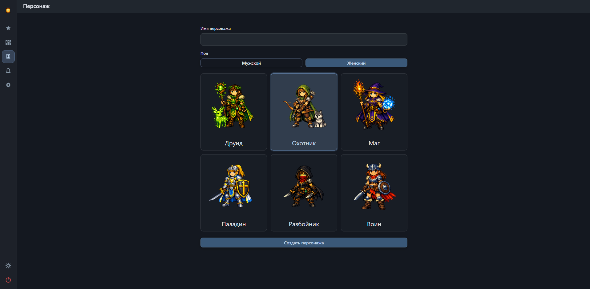

### Воркспейсы и доска

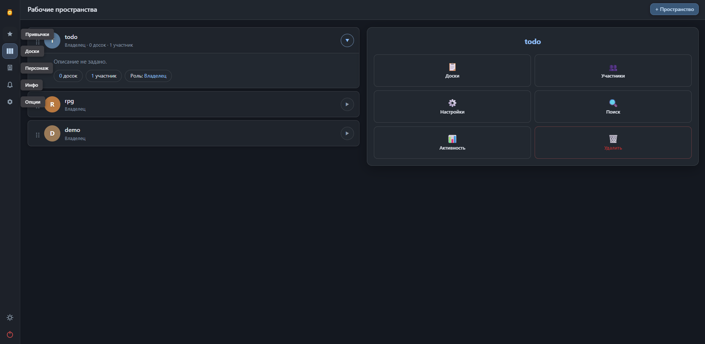
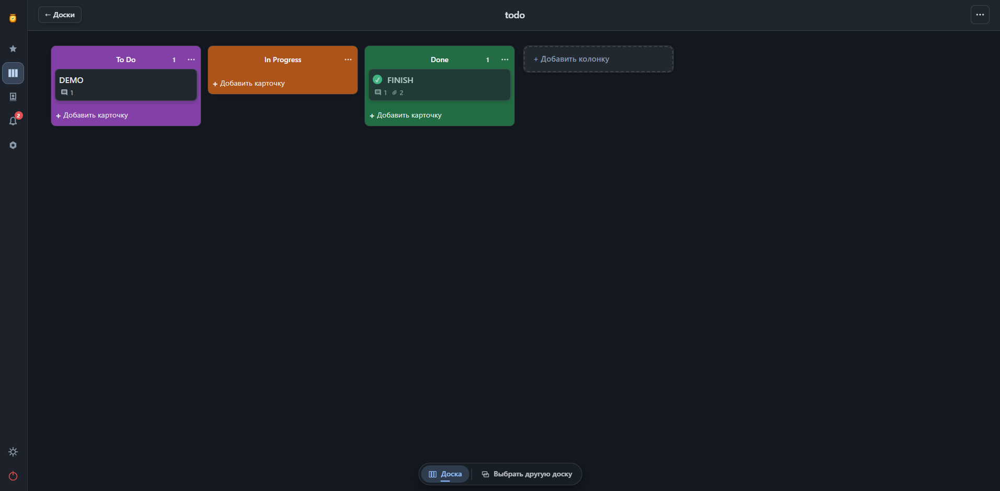
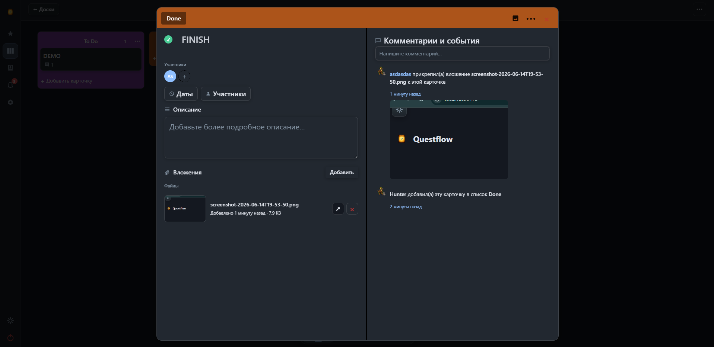

### Привычки

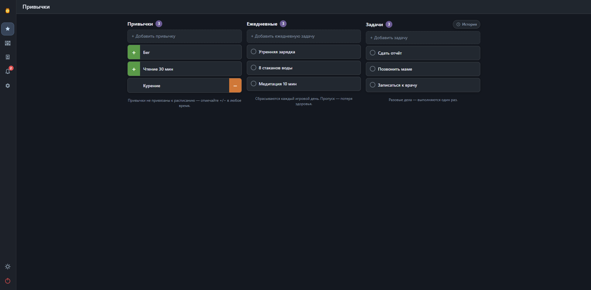


### Персонаж

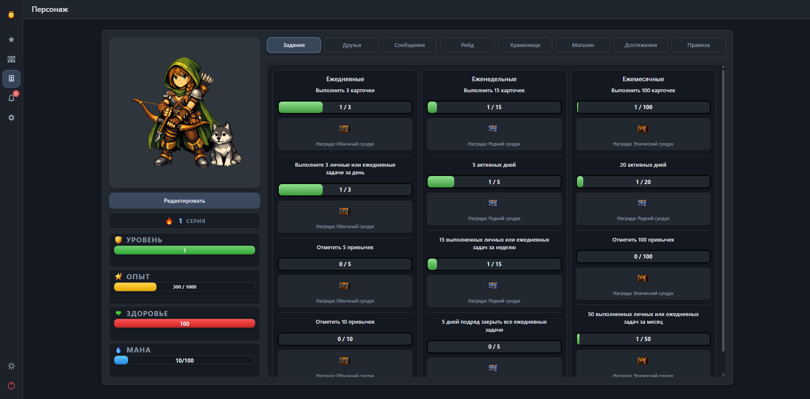
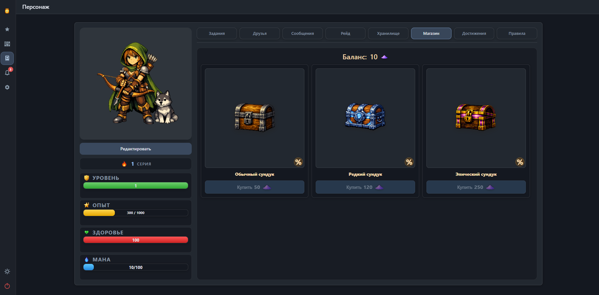
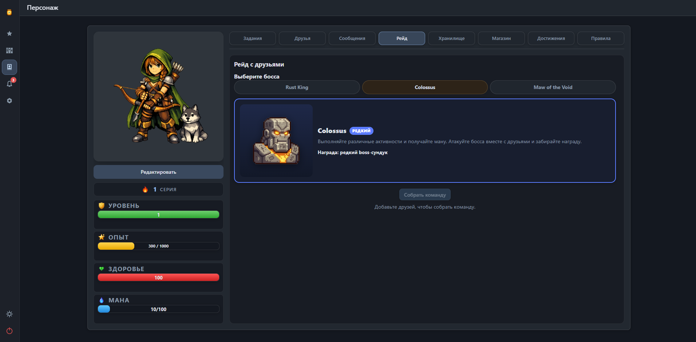

### Настройки и уведомления

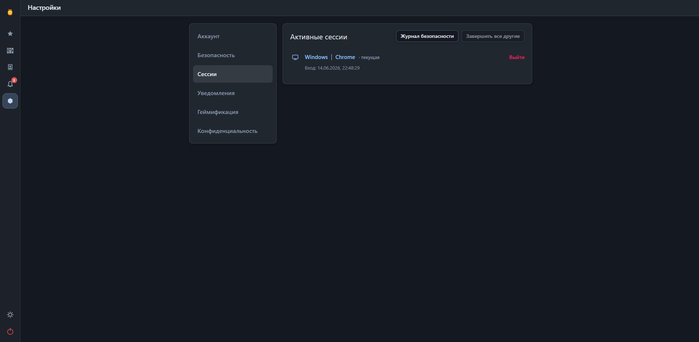
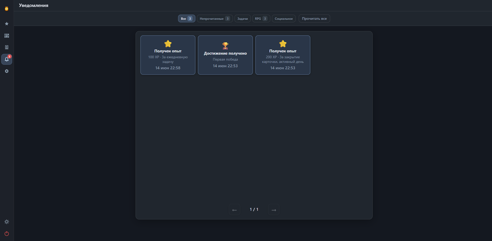
